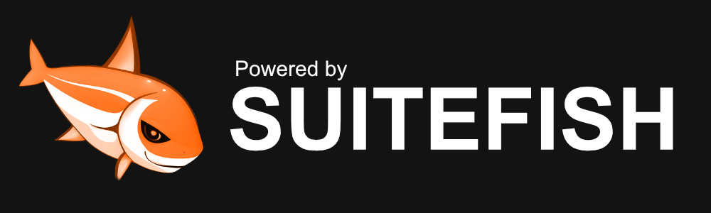

# Suitefish - CMS



## 🚀 Introduction

Suitefish-CMS is a powerful and versatile content management system designed to empower both end-users and developers alike. Whether you're a business owner looking to streamline your online presence or a developer seeking robust backend functionalities, Suitefish-CMS has you covered.

You can extend the CMS Functionality by adding Modules or extensions out of the internal store or by uploading them manually if you obtained them at our store. Visit the official suitefish-cms website/store for more information at: [https://suitefish.com](https://suitefish.com).

Get started by visiting our installation page at [https://bugfishtm.github.io/suitefish-cms/installation.html](https://bugfishtm.github.io/suitefish-cms/installation.html)!

---

## 🔥 Features

Delivers the essential tools to effectively manage your site’s content, structure, and user roles—streamlined for simplicity, without unnecessary complexity. For a broad overview of its capabilities, refer to the feature list below.

### 🛡️ Access Control

The software features a robust user and group management system, enabling administrators to efficiently create, organize, and manage both users and user groups. With flexible permission controls, administrators can assign specific access rights to groups and individual users, ensuring secure and streamlined management of user privileges across the platform.

### 💾 File Management

Provides comprehensive tools for uploading, organizing, and managing media assets efficiently within the platform. This ensures an orderly, accessible, and well-structured file system, enabling users to quickly find, categorize, and maintain digital content. With support for metadata tagging, folder organization, and advanced search capabilities, the system helps streamline media workflows and improves overall asset management productivity.

### 🏷️ Page Manager

Create and manage custom frontend and backend pages with an function and control editor. Easily design layouts, add content, and control access permissions for each page, enabling secure and flexible site management for all user roles.

### 🔧 Objects and Workflows

A lightweight PHP tool that manages object creation, dependencies, and lifecycle, streamlining the development of modular, maintainable applications. It provides robust features for CMS design, item processing, and site management, enabling teams to efficiently organize and maintain complex digital environments with flexibility and control.

### 🧩 Extendability

The software includes a built-in store system that allows users to download and deploy modules directly from within the platform. These modules can significantly alter and customize the entire CMS environment, offering powerful flexibility. By default, end users access the integrated store, but developers have the option to configure the system to connect to their own custom stores for deploying proprietary or third-party extensions. Modules can be installed seamlessly via the website interface or manually by uploading .zip files, providing convenience for standard users and flexibility for advanced developers alike.

### 🤖 AI Integration

Suitefish supports integration with various API endpoints, including OpenAI, allowing seamless interaction with AI models embedded within your projects. The platform includes a comprehensive system for creating AI Agents, which can be assigned to users or managed directly by users themselves for personalized AI-driven chats and interactions. Additionally, Suitefish offers support for Vision AI and image generation, enabling advanced multimedia capabilities within your applications.

### 🏳️‍🌈 Multi-Language Support

This project supports multiple languages, including German, English, Spanish, Italian, French, Japanese, Chinese, Russian, Hindi, Portuguese, Korean, and Turkish. You can add new languages or modify existing text on the website by overriding translations.

### 🖥️ Integrated Installer 

The installation process is simplified through a clear and intuitive graphical user interface (GUI), making setup quick and accessible for users with minimal technical experience. Additionally, advanced users can choose from alternative installation methods such as Docker containers or automated scripts, providing flexible deployment options to suit different environments and preferences.

### 🔄 Integrated Updater

The software offers a user-friendly GUI-based updater tool that simplifies CMS maintenance by ensuring core components, extension modules, and site modules remain current with minimal user effort. It also supports seamless database updates through integrated update scripts that apply changes progressively based on build numbers, providing a comprehensive and automated system update experience.

### 🪟 Windows Software

The Suitefish Windows application (https://github.com/bugfishtm/suitefish-windows) enables seamless software updating and deployment through the Suitefish web CMS. It allows users to manage, download, and deploy software directly from the Suitefish store within a Windows environment, providing convenient desktop integration and extended management capabilities tailored specifically for Windows users.

### 🐛 Developer Friendly

The software offers centralized multi-site management and integrates with Bugfish Framework for bug tracking and debugging with CSS, JavaScript, and PHP support. It includes powerful debugging tools for error detection and performance testing. 

---

## 🗒️ Requirements 

Below are the requirements for both server (root-level) and website installation methods.

### ⚙️ Website Mode

Website mode runs Suitefish as a standard site without needing root access, ideal for shared or typical web hosting. It’s easy to deploy on most hosts, offering a simple installation and management experience using default hosting features.

For detailed server requirements and installation methods see the installation documentation at: [https://bugfishtm.github.io/suitefish-cms/mode_website.html](https://bugfishtm.github.io/suitefish-cms/mode_website.html).

### ⚙️ Server Mode

Root-level installation sets up the CMS as a server backend with full control, ideal for managing servers and running advanced services. This requires a dedicated root or virtual server and unlocks system-level features for deeper integration.

For detailed server requirements and installation methods see the installation documentation at: [https://bugfishtm.github.io/suitefish-cms/mode_server.html](https://bugfishtm.github.io/suitefish-cms/mode_server.html).

---

## 🛠️ Installation 

You can see detailed information at the installation documentation page at: [https://bugfishtm.github.io/suitefish-cms/installation.html](https://bugfishtm.github.io/suitefish-cms/installation.html).

You can install the CMS in two ways: Root-Level Installation (Server-Mode) gives you full server control and access to advanced features, but requires a dedicated VPS or root server. Website Mode runs the CMS as a standard website, making it easy to deploy on shared or managed hosting without root access. Choose the method that best fits your hosting environment and needs.
 
 The initial user account created for the website during installation serves as the primary administrator. This account has full access to configure and manage the system. It is important to secure this account by updating its credentials promptly after installation to protect the site from unauthorized access. 
 
🧍 **Initial username:** admin@admin.local  
🔑 **Initial password:** changeme  

Consider setting up additional user accounts with appropriate roles and permissions to ensure proper administration and security management going forward.

### ✋ Manual

> ⚠️ It is highly recommended to change the superuser password immediately after installation.

Installing the CMS is straightforward, whether you choose root-level (server-mode) access mode or the default website mode. For detailed instructions on manual installation, please refer to the documentation located in the index.html file within the repository's docs folder, or visit https://bugfishtm.github.io/suitefish-cms/installation_manual.html.

### 🐳 Docker

> ⚠️ It is highly recommended to change the superuser password immediately after installation.

This method installs the standard version of Suitefish-CMS, providing full website functionality (website-mode). Please note that the Docker setup runs in a containerized environment, so it does not grant deep system or root-level access required for advanced system authority operations. This ensures a secure and isolated installation suitable for most web use cases. For Docker installation, visit: https://hub.docker.com/r/bugfishtm/suitefish.

### 📄 Script

> ⚠️ It is highly recommended to change the superuser password immediately after installation.

This script is intended for use only on freshly installed servers. In the github repository's `_scripts` folder, you'll find an installation script designed to install the full version with all features on a dedicated server.  Execute the following Commands and navigate through the installation shell process to install suitefish-cms on a fresh server with full root-level access in server-mode.

```bash
curl -o ./installer.sh https://raw.githubusercontent.com/bugfishtm/suitefish-cms/refs/heads/main/_scripts/installer.sh
chmod u+x ./installer.sh  
sh ./installer.sh install
```

This script is intended for users who wish to utilize advanced functionality on a fresh system.

---

## 📖 Documentation

The following documentation is intended for both end-users and developers.

| Description | Link  | Scope  |
|----------------|----------------------------|--------|
| Suitefish Tutorial Videos | [https://www.youtube.com/playlist?list=PL6npOHuBGrpAfrpUzQPTOWdqoCnhq1oP0](https://www.youtube.com/playlist?list=PL6npOHuBGrpAfrpUzQPTOWdqoCnhq1oP0)| Users |
| Suitefish Tutorial Videos (Local) | ./_videos | Developers |
| Suitefish Documentation                                                                                              | [https://bugfishtm.github.io/suitefish-cms/](https://bugfishtm.github.io/suitefish-cms/)| Developers |
| Suitefish Documentation (Local) | ./docs/index.html | Developers |
| Bugfish Framework Documentation                                                                                        | [https://bugfishtm.github.io/suitefish-cms/extra-framework/](https://bugfishtm.github.io/suitefish-cms/extra-framework/)  | Developers |
| Bugfish Framework Documentation (Local) | ./docs/suitefish-cms/extra-framework/index.html | Developers |
| AdminBSB Theme Documentation                                                                                        | [https://bugfishtm.github.io/suitefish-cms/extra-adminbsb/](https://bugfishtm.github.io/suitefish-cms/extra-adminbsb/)  | Developers |
| AdminBSB Theme Documentation (Local) | ./docs/suitefish-cms/extra-adminbsb/index.html | Developers |

Relevant github repositories related to suitefish-cms.

| Description | Link  | Scope  |
|----------------|----------------------------|---|
| Suitefish-CMS | [https://github.com/bugfishtm/suitefish-cms](https://github.com/bugfishtm/suitefish-cms)| Users |
| Suitefish Official Module Library | [https://github.com/bugfishtm/suitefish-modules](https://github.com/bugfishtm/suitefish-modules)| Developers |
| Suitefish Windows Software | [https://github.com/bugfishtm/suitefish-windows](https://github.com/bugfishtm/suitefish-windows)| Users |
| Bugfish Framework | [https://github.com/bugfishtm/bugfish-framework](https://github.com/bugfishtm/bugfish-framework)| Developers |

Relevant docker repositories related to suitefish-cms.

| Description | Link  | Scope  |
|----------------|----------------------------|--------|
| Suitefish Docker Base Image | [https://hub.docker.com/r/bugfishtm/sf-base](https://hub.docker.com/r/bugfishtm/sf-base)| Developers |
| Suitefish Docker Image  | [https://hub.docker.com/r/bugfishtm/suitefish](https://hub.docker.com/r/bugfishtm/suitefish) | Users |

---

## 📁 Repository Structure 

This table provides an overview of key files and folders related to the repository. Click on the links to access each file for more detailed information. If certain folders are missing from the repository, they are irrelevant to this project.

| Document Type | Description |
|----|-----|
| .git/ | Internal file, that can be ignored. |
| .github/ | Internal file, that can be ignored. |
| [.github/CODE_OF_CONDUCT.md](./.github/CODE_OF_CONDUCT.md) | Suitefish community guidelines for participation. |
| _archive/ | Folder for storing archived or deprecated files. |
| _changelogs/ | Folder containing changelogs for version tracking. |
| _developers/ | Folder with resources and documentation for developers. |
| _docker/ | Folder with Docker-related files for building images. |
| _images/ | Folder containing project images and graphics. |
| _licenses/ | Folder with third-party license information. |
| _packages/ | Folder for installable packages, mainly for suitefish-cms. |
| _releases/ | Folder containing release versions of the project. |
| _screenshots/ | Folder with screenshots of the project. |
| _scripts/ | Folder for additional scripts and utilities. |
| _source/ | Folder containing the main source code. |
| _videos/ | Folder with project-related videos. |
| docs/ | Folder for documentation and guides. |
| .gitattributes | Internal file, that can be ignored. |
| .gitignore | Internal file, that can be ignored. |
| repository_reset.bat | Internal file, that can be ignored. |
| repository_update.bat | Internal file, that can be ignored. |
| [CHANGELOG.md](CHANGELOG.md) | Internal file, that can be ignored. |
| [CONTRIBUTING.md](CONTRIBUTING.md) | Suitefish contributors instruction file. |
| [SECURITY.md](SECURITY.md) | Suitefish security and warranty file. |
| [LICENSE.md](LICENSE.md) | Suitefish license file. |
| [README.md](README.md) | Suitefish readme file. |

---

## 🏷️ Versioning Codenames

The software adopts various codenames to indicate the release type and its intended use. You can identify the codename corresponding to your installed version by checking the `_core/version.php` file in your source code. The following table details each codename and its specific purpose.

| Codename | Version        | Purpose                           |
|----------|---------------|-----------------------------------|
| Weasel   | >7.10         | Alpha releases for early testing.  |
| Rat      | 7.10/7.10.100 | Beta releases for feature preview. |
| Onyx     | 7.10/7.10.100 | Stable production releases.        |

---

## 💬 Support Channels

If you encounter any issues or have questions while using this software, feel free to contact us:

- **GitHub Issues** is the main platform for reporting bugs, asking questions, or submitting feature requests: [https://github.com/bugfishtm/suitefish-cms/issues](https://github.com/bugfishtm/suitefish-cms/issues)
- **Discord Community** is available for live discussions, support, and connecting with other users: [Join us on Discord](https://discord.com/invite/xCj7AEMmye)  
- **Email support** is recommended only for urgent security-related issues: [security@bugfish.eu](mailto:security@bugfish.eu)

---

## 📢 Spread the Word

Help us grow by sharing this project with others! You can:  

* **Tweet about it** – Share your thoughts on [Twitter/X](https://twitter.com) and link us!  
* **Post on LinkedIn** – Let your professional network know about this project on [LinkedIn](https://www.linkedin.com).  
* **Share on Reddit** – Talk about it in relevant subreddits like [r/programming](https://www.reddit.com/r/programming/) or [r/opensource](https://www.reddit.com/r/opensource/).  
* **Tell Your Community** – Spread the word in Discord servers, Slack groups, and forums.  

---

## 🦈 Powered by Suitefish

This project has been created with [Suitefish-CMS](https://github.com/bugfishtm/suitefish-cms). The Backend consists of a various set of Suitefish functionalities and the full included [Bugfish-Framework](https://github.com/bugfishtm/bugfish-framework).

---

## 📑 Changelog Information

Refer to the _changelogs folder for detailed HTML changelogs tracking updates across versions. These changelogs are also included in GitHub Releases for easy access.

---

## 🌱 Contributing to the Project

I am excited that you're considering contributing to our project! Here are some guidelines to help you get started.

We primarily accept security fixes and critical patches to maintain project stability and coherence. Feature updates are not accepted to preserve our backend architecture and overall project integrity.

If you wish to extend functionality, please develop a custom extension module outside the core code and integrate it via the CMS system.

Below is an example of how to contribute to this GitHub project. Please follow this guideline and all other contribution rules carefully; otherwise, your request may be denied.

- Fork the repository to create your own copy.
- Create a new branch for your changes (e.g., feature/my-feature).
- Make your changes and verify everything works correctly.
- Commit your changes with clear and concise messages.
- Push your branch to your forked repository.
- Open a pull request to the main repository’s main branch with a detailed description of your changes.
- Reference any related issues or discussions in your pull request.

To ensure your implementation is effective and maintainable by other developers, please follow the code quality guidelines outlined below.

- Keep your code clean and well-organized.
- Add comments to explain complex logic or functions.
- Use meaningful and consistent variable and function names.
- Break down code into smaller, reusable functions and components.
- Follow proper indentation and formatting practices.
- Avoid code duplication by reusing existing functions or modules.
- Ensure your code is easily readable and maintainable by others.

If you encounter a bug or have an enhancement suggestion, please check the "Issues" section of our GitHub repository or visit our official website for guidance before beginning any work on it.

---

## 🤝 Community Guidelines

We’re focused on developing innovative solutions and advancing technology. By being part of this, you contribute to our progress.

Positive guidelines include being kind, empathetic, and respectful in all interactions. It is important to engage thoughtfully and offer constructive, solution-oriented feedback. Fostering an environment of collaboration, support, and mutual respect is essential.

Unacceptable behaviors include harassment, hate speech, or offensive language. Personal attacks, discrimination, or any form of bullying are not tolerated. Sharing private or sensitive information without explicit consent is strictly prohibited.

Together, we can partner to achieve common goals by following guidelines designed to promote effective collaboration and positive teamwork.

---

## 🛡️ Security Policy

I take security seriously and appreciate responsible disclosure. If you discover a vulnerability, please follow these steps:

- **Do not** report it via public GitHub issues or discussions. Instead, please contact the [security@bugfish.eu](mailto:security@bugfish.eu) email address directly.  
- Provide as much detail as possible, including a description of the issue, steps to reproduce it, and its potential impact.  

I aim to acknowledge reports within **2–4 weeks** and will update you on our progress once the issue is verified and addressed.

This software is provided as-is, without any guarantees of security, reliability, or fitness for any particular purpose. We do not take responsibility for any damage, data loss, security breaches, or other issues that may arise from using this software. By using this software, you agree that We are not liable for any direct, indirect, incidental, or consequential damages. Use it at your own risk.


---

## 📜 License Information

The license for this software can be found in the [LICENSE.md](LICENSE.md) file. Third-party licenses are located in the ./_licenses folder. The software may also include additional licensed software or libraries.

Below is a list of the integrated libraries utilized within the core system of the Suitefish license. Relevant license information for these code is maintained within the _licenses folder in the suitefish-cms repository.

| Name | License |
|------|------|
| suitefish | GNU General Public License v3 (GPLv3) |
| simple-mail-template | Massachusetts Institute of Technology License (MIT) |
| phpmailer | GNU Lesser General Public License v2.1 (LGPL-2.1) |
| bugfish-framework | GNU Lesser General Public License v2.1 (LGPL-2.1) |
| html-error-pages | Massachusetts Institute of Technology License (MIT) | 

The following section presents the integrated default fonts utilized by the CMS. Relevant license information for these fonts is maintained within the _licenses folder in the suitefish-cms repository.

| Name | License |
|------|------|
| rocksalt | Apache License 2.0 |
| roboto | Apache License 2.0 | 
| lato | SIL Open Font License 1.1 (OFL 1.1) | 
| comicneue | SIL Open Font License 1.1 (OFL 1.1) | 
| changa | SIL Open Font License 1.1 (OFL 1.1) | 

Below is a table listing the integrated libraries used in suitefish-cms, located in the _core/_vendor folder. License details for these libraries are maintained in the _licenses folder of the suitefish-cms repository.

| Name | License |
|------|------|
| popperjs | Massachusetts Institute of Technology License (MIT) | 
| adminbsb | Massachusetts Institute of Technology License (MIT) | 
| alpine | Massachusetts Institute of Technology License (MIT) | 
| animatecss | Massachusetts Institute of Technology License (MIT) | 
| animated-event-calendar-gc | Massachusetts Institute of Technology License (MIT) | 
| autosize | Massachusetts Institute of Technology License (MIT) | 
| bootstrap5 | Massachusetts Institute of Technology License (MIT) | 
| bootstrap3 | Massachusetts Institute of Technology License (MIT) | 
| bootstrap-tagsinput | Massachusetts Institute of Technology License (MIT) | 
| bootstrap-select | Massachusetts Institute of Technology License (MIT) | 
| bootstrap-notify | Massachusetts Institute of Technology License (MIT) | 
| bootstrap-material-datetimepicker | Massachusetts Institute of Technology License (MIT) | 
| bootstrap-colorpicker | Massachusetts Institute of Technology License (MIT) | 
| boxicons | Massachusetts Institute of Technology License (MIT) | 
| bugfish-jquery-sortselect | Massachusetts Institute of Technology License (MIT) | 
| chartist | Do What The F*ck You Want To Public License (WTFPL) | 
| chartist-plugin-tooltips | Do What The F*ck You Want To Public License (WTFPL) | 
| chartjs | Massachusetts Institute of Technology License (MIT) | 
| choicesjs |  Massachusetts Institute of Technology License (MIT) | 
| chosen |  Massachusetts Institute of Technology License (MIT) | 
| codemirror |  Massachusetts Institute of Technology License (MIT) | 
| country-flag-icons |  Massachusetts Institute of Technology License (MIT) | 
| datatables | Massachusetts Institute of Technology License (MIT) | 
| dropzone | Massachusetts Institute of Technology License (MIT) | 
| editable-table | Massachusetts Institute of Technology License (MIT) | 
| evo-event-calendar | Massachusetts Institute of Technology License (MIT) | 
| excanvas | Apache License 2.0 | 
| feather-icons | Massachusetts Institute of Technology License (MIT) | 
| flot-charts | Massachusetts Institute of Technology License (MIT) | 
| focustrap | Massachusetts Institute of Technology License (MIT) | 
| font-awesome | Creative Commons Attribution 4.0 International (CC BY 4.0) (Icons) | 
|  | SIL Open Font License 1.1 (OFL 1.1) (Fonts) | 
| free-file-icons | Massachusetts Institute of Technology License (MIT) | 
| githubbuttons | Berkeley Software Distribution 2-Clause (BSD-2-Clause) | 
| gmaps | Massachusetts Institute of Technology License (MIT) | 
| hugerte | Massachusetts Institute of Technology License (MIT) | 
| immutable | Massachusetts Institute of Technology License (MIT) | 
| ion-rangeslider | Massachusetts Institute of Technology License (MIT) | 
| jquery | Massachusetts Institute of Technology License (MIT) | 
| jquery-cookie | Massachusetts Institute of Technology License (MIT) | 
| jquery-countto | Massachusetts Institute of Technology License (MIT) | 
| jquery-gantt | Massachusetts Institute of Technology License (MIT) | 
| jquery-inputmask | Massachusetts Institute of Technology License (MIT) | 
| jquery-kanban-board | Massachusetts Institute of Technology License (MIT) | 
| jquery-knob | Massachusetts Institute of Technology License (MIT) | 
| jquery-slimscroll | Massachusetts Institute of Technology License (MIT) | 
| jquery-sparkline | Berkeley Software Distribution 3-Clause (BSD-3-Clause) | 
| jquery-spinner | Massachusetts Institute of Technology License (MIT) | 
| jquery-steps | Massachusetts Institute of Technology License (MIT) | 
| jquery-timeline | Massachusetts Institute of Technology License (MIT) | 
| jquery-validation | Massachusetts Institute of Technology License (MIT) | 
| jszip |  Massachusetts Institute of Technology License (MIT) | 
|  |  GNU General Public License v3 (GPLv3) | 
|  |  Dual licensed library; usage under MIT license | 
| leafletjs | Berkeley Software Distribution 2-Clause (BSD-2-Clause) | 
| magicsuggest | Massachusetts Institute of Technology License (MIT) | 
| marked | Massachusetts Institute of Technology License (MIT) | 
|  | Markdown itself has: Berkeley Software Distribution 3-Clause (BSD-3-Clause) |
| material-design-iconic-font | Apache License 2.0 | 
| materialize-css | Massachusetts Institute of Technology License (MIT) | 
| mdi | Apache License 2.0 | 
| modelviewer | Apache License 2.0 | 
| momentjs | Massachusetts Institute of Technology License (MIT) | 
| morrisjs | Berkeley Software Distribution 2-Clause (BSD-2-Clause) |
| multijs | Massachusetts Institute of Technology License (MIT) | 
| multi-select | Massachusetts Institute of Technology License (MIT) | 
| nestable | Massachusetts Institute of Technology License (MIT) | 
| nestable2 | Massachusetts Institute of Technology License (MIT) | 
|  | Berkeley Software Distribution 2-Clause (BSD-2-Clause) | 
|  | Dual licensed library; usage under MIT license | 
| node-waves | Massachusetts Institute of Technology License (MIT) | 
| notyf | Massachusetts Institute of Technology License (MIT) |
| nouislider | Massachusetts Institute of Technology License (MIT) | 
| onscreen | Massachusetts Institute of Technology License (MIT) | 
| owl-carousel-2 | Massachusetts Institute of Technology License (MIT) | 
| pdfmake | Massachusetts Institute of Technology License (MIT) | 
| progressbarjs | Massachusetts Institute of Technology License (MIT) | 
| qrcodejs | Massachusetts Institute of Technology License (MIT) | 
| raphael | Massachusetts Institute of Technology License (MIT) | 
| remix-icons | Apache License 2.0 |
| resumable | Massachusetts Institute of Technology License (MIT) | 
| sabredav | Berkeley Software Distribution 3-Clause (BSD-3-Clause) | 
| sass | Massachusetts Institute of Technology License (MIT) | 
| select2 | Massachusetts Institute of Technology License (MIT) | 
| showdown | Massachusetts Institute of Technology License (MIT) | 
| simplebar | Massachusetts Institute of Technology License (MIT) | 
| smooth-scroll | Massachusetts Institute of Technology License (MIT) |
| sortablejs | Massachusetts Institute of Technology License (MIT) | 
| sweetalert | Massachusetts Institute of Technology License (MIT) | 
| sweetalert2 | Massachusetts Institute of Technology License (MIT) | 
| tabulator | Massachusetts Institute of Technology License (MIT) | 
| tinymce | Massachusetts Institute of Technology License (MIT) | 
| typeahead | Massachusetts Institute of Technology License (MIT) | 
| vanillaJS-datepicker | Massachusetts Institute of Technology License (MIT) | 
| volt | Massachusetts Institute of Technology License (MIT) | 
| waitme | Massachusetts Institute of Technology License (MIT) | 
| waypoints | Massachusetts Institute of Technology License (MIT) | 

Please ensure compliance with the license terms of each integrated package. It is important to adhere to the permissions and restrictions of each license to maintain proper usage. We assume no responsibility or liability for any consequences resulting from failure to comply with these license agreements.

🐟 Bugfish 
