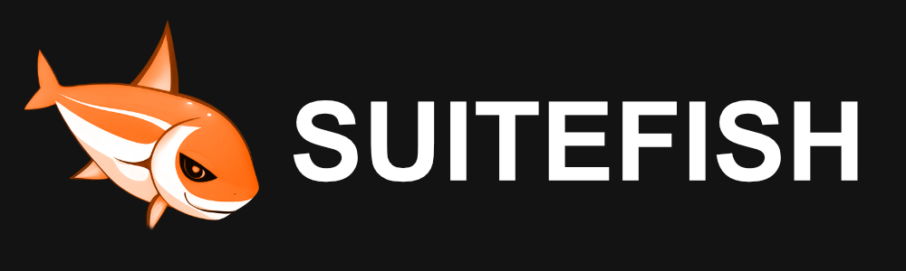
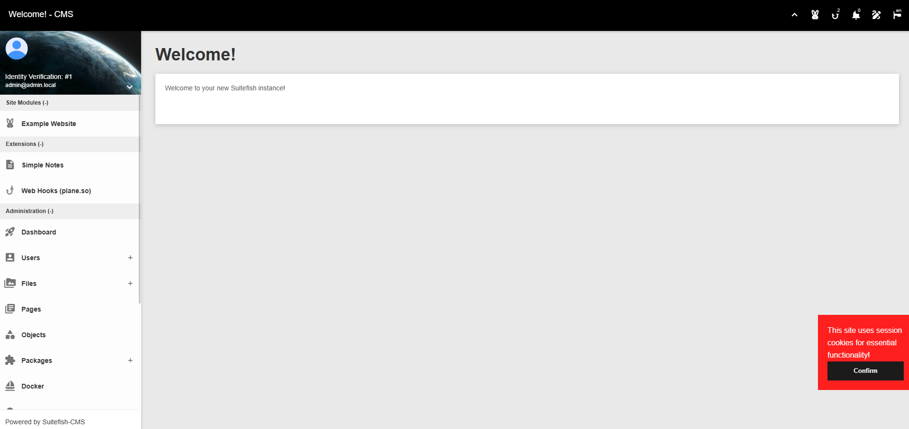

# ⚠️ Warning

> 🚧 **This project is currently in development and should NOT be used in production.**  

# Suitefish CMS

## 🚀 Introduction

Suitefish-CMS is a powerful and versatile content management system designed to empower both end-users and developers alike. Whether you're a business owner looking to streamline your online presence or a developer seeking robust backend functionalities, Suitefish-CMS has you covered.

You can extend the CMS Functionality by adding Modules or extensions out of the internal store or by uploading them manually if you obtained them at our store.

### 🖥️ Installer 

Simplifies the entire installation process with a clear, intuitive graphical user interface (GUI), making setup fast and accessible even for users with minimal technical experience.

### 🔄 Updater

Offers a GUI-based updater tool designed for effortless maintenance of the CMS, ensuring modules and core components stay up to date with minimal user intervention.

### 🧑‍💼 Administrator Module 

A fully responsive backend that allows comprehensive file and user management, provides detailed debugging insights, and grants easy access to the extension store for enhanced functionality and control.

### 🛡️ Access Control

The software features a robust user and group management system, enabling administrators to efficiently create, organize, and manage both users and user groups. With flexible permission controls, administrators can assign specific access rights to groups and individual users, ensuring secure and streamlined management of user privileges across the platform.

### 💾 File Management

Provides robust tools for uploading, organizing, and managing media assets efficiently, helping maintain an orderly and accessible file system within the platform.

### 🧩 Extendability

The software includes a built-in store system that allows users to download and deploy modules directly within the platform. By default, end users access the integrated store (set to https://suitefish.com in the ruleset.cfg configuration file), but developers can configure the system to point to their own custom store for deploying proprietary or third-party extensions. Modules can be installed seamlessly through the website interface or manually by uploading .zip files, providing flexibility for both standard users and advanced developers.

### 🌐 Multi-Language Support

This project supports multiple languages, including German, English, Spanish, Italian, French, Japanese, Chinese, Russian, Hindi, Portuguese, Korean, and Turkish. You can add new languages or modify existing text on the website by overriding translations.

### 🔔 Notification System

Delivers timely system notifications about important events and changes, keeping administrators informed and enabling quick responses to critical updates or issues.

### 🪟 Windows Software

A dedicated Windows application is available at https://github.com/bugfishtm/suitefish-windows, enabling seamless use of the CMS store for software deployment and offering additional management features tailored for Windows environments.

### 🐛 Developer Features

The software offers centralized multi-site management and integrates with Bugfish Framework for bug tracking and debugging with CSS, JavaScript, and PHP support. It includes powerful debugging tools for error detection and performance testing. Users can switch themes and colors dynamically and load CSS/JS files on demand for better performance. The updater backend handles module updates, while dynamic code loading and cronjobs enable flexible scripting and task automation. Extensions can be added from custom or store sources. Deployment features manage Suitefish-CMS clusters and updates via a public store. Pre-designed templates simplify website design, and example modules provide useful references.

## 🛠️ Installation 

You have different options to install the CMS Software, you can see detailed information at the installation documentation page at: [https://bugfishtm.github.io/suitefish-cms/installation.html](https://bugfishtm.github.io/suitefish-cms/installation.html).

>Initial user account for the website after deployment:  
username: admin@admin.local  
password: changeme  
It is urgently advised to change this directly after deployment!

### 🐳 Docker

This method installs the standard version of Suitefish-CMS, providing full website functionality. Please note that the Docker setup runs in a containerized environment, so it does not grant deep system or root-level access required for advanced system authority operations. This ensures a secure and isolated installation suitable for most web use cases. For Docker installation, visit: https://hub.docker.com/r/bugfishtm/suitefish.

### 📄 Script

> This script is intended for use only on freshly installed servers and may corrupt running services or operations.

In the github repository's `_scripts` folder, you'll find an installation script designed to install the full version with all features on a root server. This script is intended for users who wish to utilize our advanced hosting functionality on a fresh system. It is recommended only for advanced users with their own servers and infrastructure.

- Upload the suitefish.sh script to your fresh server.
- Execute Command: `chmod u+x ./suitefish.sh`  
- Execute Command: `sh ./suitefish.sh install`  
- Navigate through the installation process.

### ✋ Manual

Installing the CMS is straightforward, whether you choose root-level access mode or the default website mode. For detailed instructions on manual installation, please refer to the documentation located in the index.html file within the repository's docs folder, or visit https://bugfishtm.github.io/suitefish-cms/installation.html.

## 📖 Documentation

The following documentation is intended for both end-users and developers.

| **Description**                                                       | **Link**                                                                                         |
|----------------------------------------------------------------------|-------------------------------------------------------------------------------------------------|
| A playlist or video related to this project. | [https://www.youtube.com/playlist?list=PL6npOHuBGrpAfrpUzQPTOWdqoCnhq1oP0](https://www.youtube.com/playlist?list=PL6npOHuBGrpAfrpUzQPTOWdqoCnhq1oP0)|
| If this repository contains a _videos folder, you can check that as well. | |

The following documentation is intended for developers.

| Description | Link  |
|----------------|----------------------------|
| CMS Developer Documentation                                                                                              | [https://bugfishtm.github.io/suitefish-cms/](https://bugfishtm.github.io/suitefish-cms/)|
| Framework Developer Documentation                                                                                        | [https://bugfishtm.github.io/bugfish-framework/](https://bugfishtm.github.io/bugfish-framework/)  |
| AdminBSB Theme Developer Documentation                                                                                        | [https://bugfishtm.github.io/suitefish-cms/extra-adminbsb/](https://bugfishtm.github.io/suitefish-cms/extra-adminbsb/)  |

The following sites may be interestinig for docker instance developers and users.

| Description | Link  |
|----------------|----------------------------|
| Developer Base Image | [https://hub.docker.com/r/bugfishtm/sf-base](https://hub.docker.com/r/bugfishtm/sf-base)|
| Suitefish on Docker | [https://hub.docker.com/r/bugfishtm/suitefish](https://hub.docker.com/r/bugfishtm/suitefish)|

Relevant GitHub Repositories.

| Description | Link  |
|----------------|----------------------------|
| Suitefish-CMS | [https://github.com/bugfishtm/suitefish-cms](https://github.com/bugfishtm/suitefish-cms)|
| Suitefish Official Module Library | [https://github.com/bugfishtm/suitefish-modules](https://github.com/bugfishtm/suitefish-modules)|
| Suitefish Windows Software | [https://github.com/bugfishtm/suitefish-windows](https://github.com/bugfishtm/suitefish-windows)|
| Bugfish Framework | [https://github.com/bugfishtm/bugfish-framework](https://github.com/bugfishtm/bugfish-framework)|

Interesting websites.

| Description | Link  |
|----------------|----------------------------|
| Bugfish Website | [https://bugfish.eu](https://bugfish.eu)|
| Suitefish-CMS Store / Website | [https://suitefish.com](https://suitefish.com)|

## ❓ Support Channels

If you encounter any issues or have questions while using this software, feel free to contact us:

- **GitHub Issues** is the main platform for reporting bugs, asking questions, or submitting feature requests: [https://github.com/bugfishtm/suitefish-cms/issues](https://github.com/bugfishtm/suitefish-cms/issues)
- **Discord Community** is available for live discussions, support, and connecting with other users: [Join us on Discord](https://discord.com/invite/nqe2HSuKee)  
- **Email support** is recommended only for urgent security-related issues: [security@bugfish.eu](mailto:security@bugfish.eu)

## 📢 Spread the Word

Help us grow by sharing this project with others! You can:  

* **Tweet about it** – Share your thoughts on [Twitter/X](https://twitter.com) and link us!  
* **Post on LinkedIn** – Let your professional network know about this project on [LinkedIn](https://www.linkedin.com).  
* **Share on Reddit** – Talk about it in relevant subreddits like [r/programming](https://www.reddit.com/r/programming/) or [r/opensource](https://www.reddit.com/r/opensource/).  
* **Tell Your Community** – Spread the word in Discord servers, Slack groups, and forums.  

## 📁 Repository Structure 

This table provides an overview of key files and folders related to the repository. Click on the links to access each file for more detailed information. If certain folders are missing from the repository, they are irrelevant to this project.

|Document Type|Description|
|----|-----|
| .github | Folder with github setup files. |
| [.github/CODE_OF_CONDUCT.md](./.github/CODE_OF_CONDUCT.md) | The community guidelines. |
| _archive | Folder for archived files. |
| _changelogs | Folder for changelogs. |
| _developers | Folder with content for developers. |
| _docker | Folder to prepare docker images. |
| _images | Folder for project images. |
| _licenses | Folder for 3rd party licenses. |
| _packages | Folder for installable packages mostly for suitefish-cms. |
| _releases | Folder for releases. |
| _screenshots | Folder with project screenshots. |
| _scripts | Folder with additional scripts. |
| _source | Folder with the source code. |
| _videos | Folder with videos related to the project. |
| docs | Folder for the documentation. | 
| .gitattributes | Repository setting file. Only for development purposes. |
| .gitignore | Repository ignore file. Only for development purposes. |
| README.md | Readme of this project. You are currently looking at this file. |
| repository_reset.bat | File to reset this repository. Only for development purposes. |
| repository_update.bat | File to update this repository. Only for development purposes. |
| [CONTRIBUTING.md](CONTRIBUTING.md) | Information for contributors. | 
| [CHANGELOG.md](CHANGELOG.md) | Information about changelogs. | 
| [SECURITY.md](SECURITY.md) | How to handle security issues. |
| [LICENSE.md](LICENSE.md) | License of this project. |

## 📑 Changelog Information

Refer to the `_changelogs` folder for detailed insights into the changes made across different versions. The changelogs are available in **HTML format** within this folder, providing a structured record of updates, modifications, and improvements over time. Additionally, **GitHub Releases** follow the same structure and also include these changelogs for easy reference.

## 🌱 Contributing to the Project

I am excited that you're considering contributing to our project! Here are some guidelines to help you get started.

**How to Contribute**

1. Fork the repository to create your own copy.
2. Create a new branch for your work (e.g., `feature/my-feature`).
3. Make your changes and ensure they work as expected.
4. Run tests to confirm everything is functioning correctly.
5. Commit your changes with a clear, concise message.
6. Push your branch to your forked repository.
7. Submit a pull request with a detailed description of your changes.
8. Reference any related issues or discussions in your pull request.

**Coding Style**

- Keep your code clean and well-organized.
- Add comments to explain complex logic or functions.
- Use meaningful and consistent variable and function names.
- Break down code into smaller, reusable functions and components.
- Follow proper indentation and formatting practices.
- Avoid code duplication by reusing existing functions or modules.
- Ensure your code is easily readable and maintainable by others.

## 🤝 Community Guidelines

We’re on a mission to create groundbreaking solutions, pushing the boundaries of technology. By being here, you’re an integral part of that journey. 

**Positive Guidelines:**
- Be kind, empathetic, and respectful in all interactions.
- Engage thoughtfully, offering constructive, solution-oriented feedback.
- Foster an environment of collaboration, support, and mutual respect.

**Unacceptable Behavior:**
- Harassment, hate speech, or offensive language.
- Personal attacks, discrimination, or any form of bullying.
- Sharing private or sensitive information without explicit consent.

Let’s collaborate, inspire one another, and build something extraordinary together!

## 🛡️ Warranty and Security

I take security seriously and appreciate responsible disclosure. If you discover a vulnerability, please follow these steps:

- **Do not** report it via public GitHub issues or discussions. Instead, please contact the [security@bugfish.eu](mailto:security@bugfish.eu) email address directly.   
- Provide as much detail as possible, including a description of the issue, steps to reproduce it, and its potential impact.  

I aim to acknowledge reports within **2–4 weeks** and will update you on our progress once the issue is verified and addressed.

This software is provided as-is, without any guarantees of security, reliability, or fitness for any particular purpose. We do not take responsibility for any damage, data loss, security breaches, or other issues that may arise from using this software. By using this software, you agree that We are not liable for any direct, indirect, incidental, or consequential damages. Use it at your own risk.

## 🦈 Powered by Suitefish

This project has been created with [Suitefish-CMS](https://github.com/bugfishtm/suitefish-cms). The Backend consists of a various set of Suitefish functionalities and the full included [Bugfish-Framework](https://github.com/bugfishtm/bugfish-framework).

## 📜 License Information

The license for this software can be found in the [LICENSE.md](LICENSE.md) file. Third-party licenses are located in the ./_licenses folder. The software may also include additional licensed software or libraries.

🐟 Bugfish 
