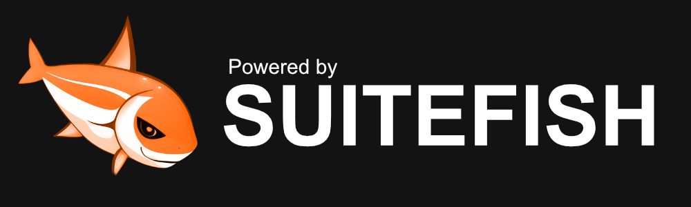

# Suitefish CMS

## Introduction

Suitefish-CMS is a powerful and versatile content management system designed to empower both end-users and developers alike. Whether you're a business owner looking to streamline your online presence or a developer seeking robust backend functionalities, Suitefish-CMS has you covered.

You can extend the CMS Functionality by adding Modules or extensions out of the internal store or by uploading them manually if you obtained them at our store.

## Screenshots
Here you can find some screenshots about this project!

  
  
  

## Features

### End-Users
This section outlines the features available to end-users. No coding knowledge is required to use these functionalities, as they are included in our Administrator Module. Simply install the CMS and log in as the initial user as described in the installation guide to access all features listed below:

| **Feature**                | **Description**                                                                                                                                             |
|----------------------------|-------------------------------------------------------------------------------------------------------------------------------------------------------------|
| Administrator Module        | Responsive backend with file, user management, debugging insights, and access to the extension store.                                                       |
| User and Group Manager      | Organize users into groups for streamlined access control, with permission management.                                                                      |
| Installer                   | Simplified installation process with a graphical user interface (GUI).                                                                                      |
| Updater                     | GUI-based updater for easy maintenance of the CMS.                                                                                                          |
| File Management             | Robust file management for uploading and organizing media assets.                                                                                           |
| Extension and Dedicated Store| Centralized marketplace for discovering, installing, and managing extensions, including setting up an extension store.                                      |
| Store System and Module Downloads | Fully functional store system for module downloads, enhancing website customization.                                                                 |
| Notification System         | System notifications for events and changes.                                                                                                               |

### Developers

These backend functionalities are tailored for developers and are essential for site modules requiring advanced coding knowledge. If there is no site module to generate the necessary code, developers can directly utilize these functionalities. Below is a detailed overview of the available backend features:

| **Feature**                 | **Description**                                                                                                                                             |
|-----------------------------|-------------------------------------------------------------------------------------------------------------------------------------------------------------|
| Multi-Site Management        | Centralized management of multiple websites.                                                                                                               |
| Framework Integration        | Integration with Bugfish Framework for bug tracking and debugging with support for CSS, JavaScript, and PHP Libraries.                                      |
| Debugging Tools              | Robust debugging tools to identify errors and test performance or SQL issues.                                                                               |
| Multi-Language Support       | Manage multiple languages for a global audience.                                                                                                           |
| Dynamic Themes and Colors    | Enable dynamic switching of themes and color adjustments.                                                                                                  |
| Dynamic CSS/JS Load          | Dynamically load CSS and JavaScript files for optimized performance.                                                                                        |
| Updater Backend              | Ready-to-use updater routines per Site Module.                                                                                                             |
| Dynamic Code Loading         | Support dynamic loading of code snippets or scripts.                                                                                                       |
| Dynamic Cronjobs             | Schedule and automate tasks with dynamic cronjobs.                                                                                                         |
| Extension Support            | Extend modules with custom or store-downloaded extensions.                                                                                                 |
| Deployment                   | Deploy and control Suitefish-CMS clusters, module updates, and core updates via a public store.                                                               |
| Integrated Templates         | Pre-designed templates for simplified website design.                                                                                                      |
| Example Modules              | Collection of example modules for reference and inspiration.                                                                                               |
| Developer-Friendly Interface | Comprehensive interface for developers to access and customize the system.                                                                                 |

## Promote us!

You want to support our project? Add or "powered by" images to your website and let users see that you are using our CMS or Framework!

